<!-- ========================= HEADER ========================= -->

  

<!-- capsule-render (banner dinâmico) -->
<!-- docs: https://github.com/kyechan99/capsule-render -->

  
  
  <!-- opcional: contador de views -->
  <!--  -->

  

<!-- ========================= ABOUT ========================= -->
<h2 align="center">🚀 Sobre</h2>

  Estudante de <b>Engenharia de Software (UTFPR, 5º período)</b> e desenvolvedor <b>Full Stack</b> na <b>Unect Jr.</b> 
  Gosto de transformar requisitos em produto: API bem estruturada + UI consistente + código sustentável.

  ✅ ~1 ano entregando <b>sistemas para clientes reais</b> (web e mobile)  
  ✅ Atuação forte em <b>NestJS/PostgreSQL</b> e <b>React/TypeScript</b>  
  ✅ Experiência com <b>design system</b> a partir do Figma e formulários robustos (Formik/Yup)

<!-- ========================= SKILLS ========================= -->
<h2 align="center">🧰 Stack</h2>

  

<!-- ========================= HIGHLIGHTS ========================= -->
<h2 align="center">📌 Highlights (experiência real)</h2>

  <b>Clínica de anestesiologia</b> — Back-end (NestJS • PostgreSQL • TypeORM) • time 3 back / 4 front • projeto ~R$30k 
  <b>Clínica (Web)</b> — Front-end (React • TS • Tailwind) • design system baseado no Figma (componentes reutilizáveis) 
  <b>AETA Tarumã (Mobile)</b> — React Native (Expo) • auth/reset/carteirinha • build Android (AAB) (publicação pendente por dependência do cliente)

<!-- ========================= PINNED REPO CARDS ========================= -->
<h2 align="center">⭐ Repositórios (pinned)</h2>

  
  
  

<!-- ========================= STATS ========================= -->
<h2 align="center">📊 Stats</h2>

  
  

  

  

<!-- ========================= RECENT ACTIVITY (AUTO) ========================= -->
<h2 align="center">⚡ Atividade recente</h2>

<!--START_SECTION:activity-->
1. 🎉 Merged PR [#3](https://github.com/JoaoTrindade1404/nest-blog/pull/3) in [JoaoTrindade1404/nest-blog](https://github.com/JoaoTrindade1404/nest-blog)
2. 💪 Opened PR [#3](https://github.com/JoaoTrindade1404/nest-blog/pull/3) in [JoaoTrindade1404/nest-blog](https://github.com/JoaoTrindade1404/nest-blog)
3. 🎉 Merged PR [#2](https://github.com/JoaoTrindade1404/nest-blog/pull/2) in [JoaoTrindade1404/nest-blog](https://github.com/JoaoTrindade1404/nest-blog)
4. 💪 Opened PR [#2](https://github.com/JoaoTrindade1404/nest-blog/pull/2) in [JoaoTrindade1404/nest-blog](https://github.com/JoaoTrindade1404/nest-blog)
<!--END_SECTION:activity-->

<!-- ========================= SNAKE (AUTO) ========================= -->
<h2 align="center">🐍 Snake das contribuições</h2>

  <picture>
    <source media="(prefers-color-scheme: dark)" srcset="https://raw.githubusercontent.com/JoaoTrindade1404/JoaoTrindade1404/output/github-snake-dark.svg" />
    <source media="(prefers-color-scheme: light)" srcset="https://raw.githubusercontent.com/JoaoTrindade1404/JoaoTrindade1404/output/github-snake.svg" />
    
  </picture>

<!-- ========================= FOOTER ========================= -->

  

